# Hybrid Wallet Security Solution

## Executive Summary
Our solution addresses critical security vulnerabilities in cryptocurrency wallets by implementing a hybrid approach that combines the security of cold storage with the convenience of hot wallets, enhanced by modern authentication methods and user-friendly interfaces.
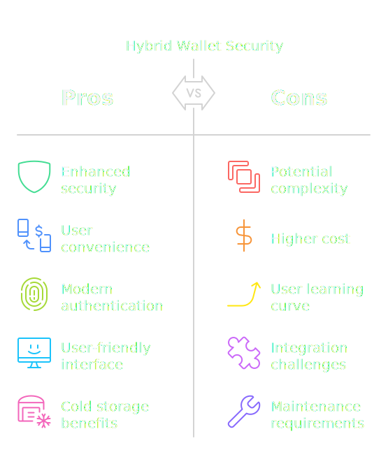

## Problem Statement
Recent cryptocurrency security breaches have highlighted significant vulnerabilities:
- Hot wallets storing private keys and secrets on internet-connected devices are susceptible to hacking
- Traditional cold storage solutions often sacrifice usability for security
- Existing solutions lack intuitive user interfaces for non-technical users
- Integration with modern communication platforms is limited

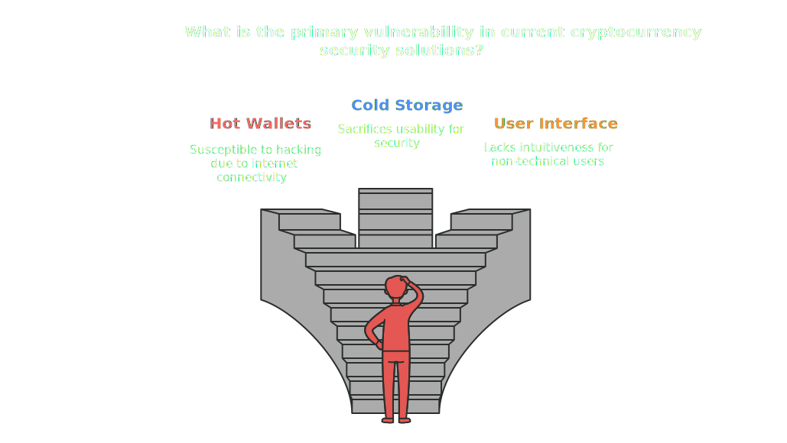

## Our Solution: Multi-Layer Secure Hybrid Wallet

### Core Architecture
1. **Hybrid Implementation (HD Wallets)**
   - Combines cold storage security with hot wallet convenience
   - Hierarchical Deterministic (HD) wallet structure for enhanced key management
   - Clear separation between transaction signing and key storage

2. **Three-Layer Security Model**
   - Hardware-level security (Cold Storage)
   - Application-level security (Hot Wallet)
   - User-level security (Biometric Authentication)

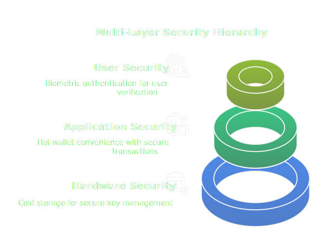

### Key Features

#### Security Innovations
- **Cold Storage Implementation**
  - QR code-based communication (preferred over NFC for security)
  - Raspberry Pi-based hardware component for secure key storage
  - Air-gapped transaction signing

- **Biometric Security**
  - Integrated facial authentication
  - Multi-factor authentication approach

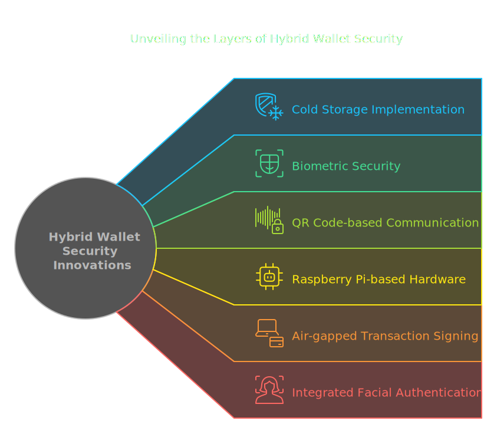

#### User Experience
- **Voice-Guided Procedures**
  - Step-by-step audio instructions
  - Reduces user error in critical operations
  - Enhances accessibility

- **Cross-Platform Compatibility**
  - Web application for hot wallet functionality
  - Native mobile applications
  - Desktop support

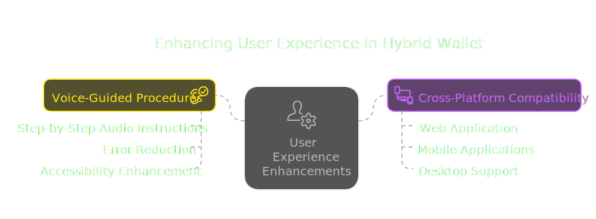

#### Integration Capabilities
- **Bot Integration**
  - Telegram bot support for transaction monitoring
  - Automated alerts and notifications
  - Secure command interface

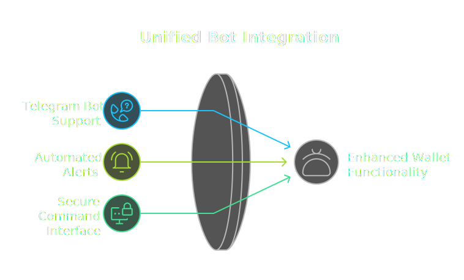

### Security Protocol

#### Wallet Creation Process
1. Initial 2-minute security window
   - QR code generation containing:
     - Seed phrase
     - Private key
     - Public key
2. Hardware scanning and secure storage
3. Automatic security lockdown after time window

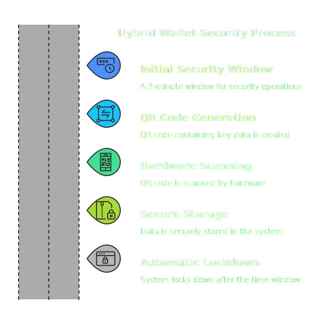

#### Transaction Flow
1. User selects wallet using public key
2. Amount specification
3. QR code generation for transaction
4. Hardware wallet scanning and signing
5. Transaction completion with cold wallet verification

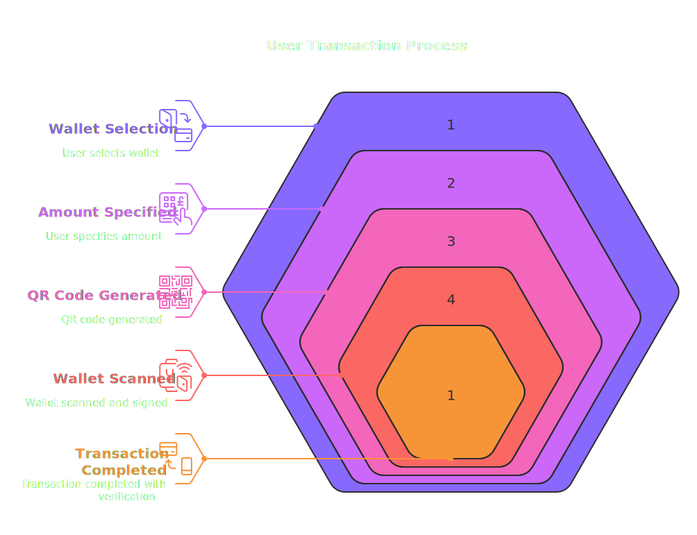

## Key Differentiators

1. **Enhanced Security**
   - No private key exposure to internet-connected devices
   - Hardware-based security with air-gapped signing
   - Multi-layer authentication

2. **User-Centric Design**
   - Voice guidance reduces technical barriers
   - Intuitive QR-based interaction
   - Cross-platform accessibility

3. **Modern Integration**
   - Bot platform support
   - Real-time monitoring
   - Automated security alerts

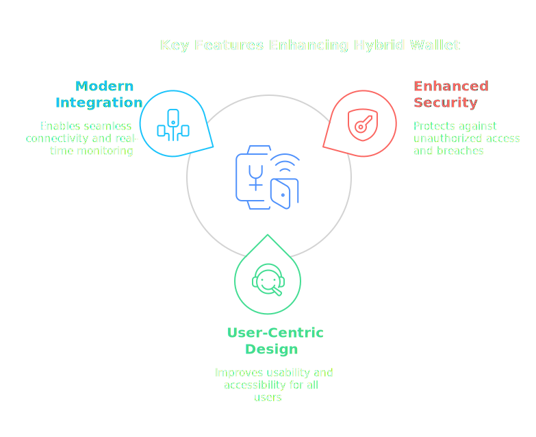

## Market Relevance
Recent cryptocurrency security breaches demonstrate the urgent need for more secure wallet solutions. Our hybrid approach directly addresses the vulnerabilities exposed in hot wallets while maintaining usability.

## Future Enhancements
1. Additional hardware wallet support
2. Expanded bot platform integration
3. Enhanced biometric security options
4. Institutional-grade security features

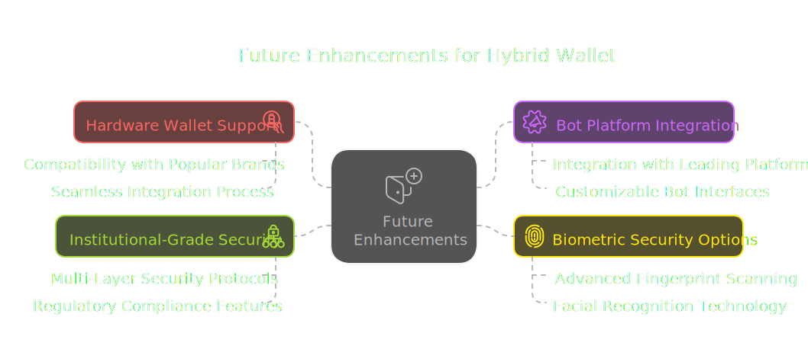
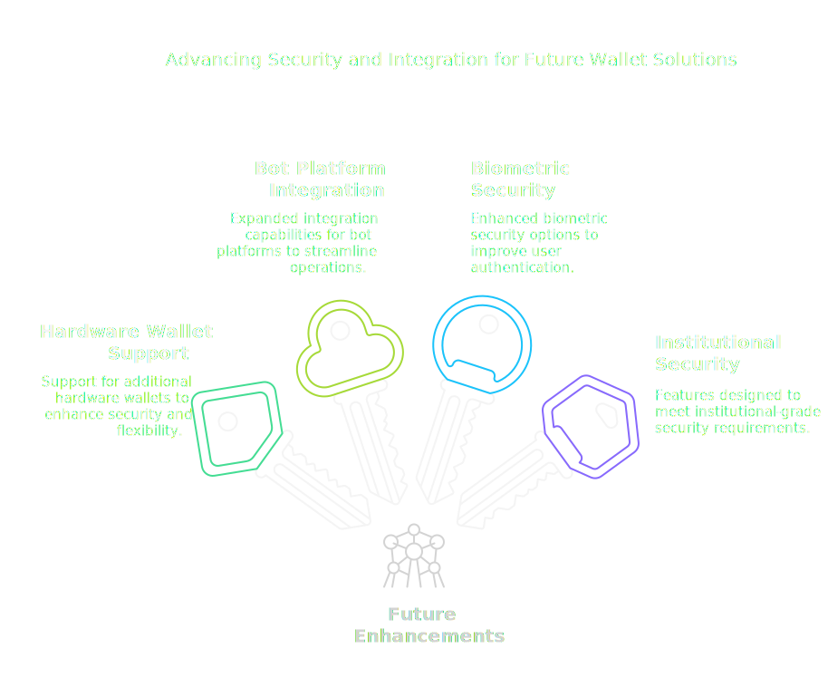